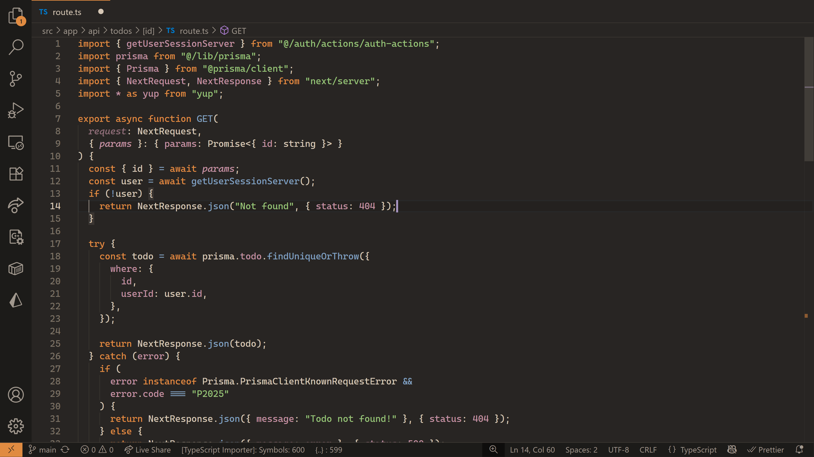

<h1 align="center">Calming Coding</h1>

A beauty and calming Visual Studio Code theme for your coding sessions.

## Installation

Install the theme from [Microsoft's MarketPlace.](https://marketplace.visualstudio.com/items?itemName=CalmingCoding.calming-coding)
