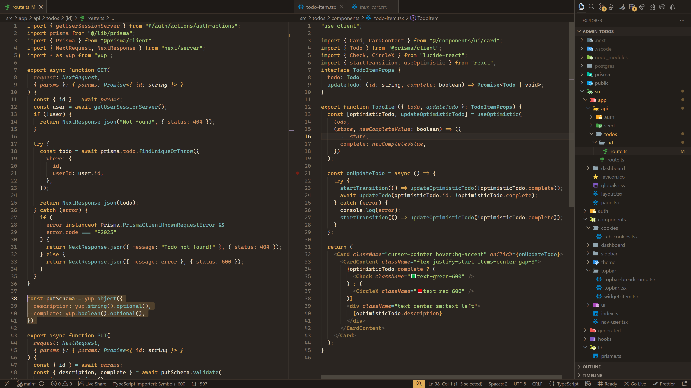

# Calming Coding

**A warm, low-saturation dark Visual Studio Code theme for long, calming coding sessions.**

A single dark theme built around a brown-and-cream base, a honey-mustard accent reserved for focus, and a fully warm palette of sage, clay, teal and coral for syntax. Designed to be easy on the eyes during long sessions without the "muddy" feeling that low-contrast themes can give to code.

---

## Highlights

- **Fully warm palette.** Brown and cream surfaces, a single honey-mustard accent reserved for focus, and four living warm tones (sage, clay, teal, coral) for syntax. No cold purples, no icy blues, no neon.
- **Designed for long sessions.** Low contrast between adjacent surfaces (so your eyes don't jump), high contrast between syntax roles (so the code still reads), and a dedicated overlay tone for popups so they feel like popups.
- **Comprehensive language coverage.** 495 token rules covering Python, JavaScript / TypeScript, Go, Rust, PHP, Java, Kotlin, C#, C / C++, Ruby, SQL, HTML, CSS / SCSS / Less, JSON, YAML, Markdown, Shell / Bash, Dockerfile, TOML, Prisma, and Zod.
- **Framework-aware.** Native rules for React, Next.js, Vue, Angular, Svelte, Astro, Django, Laravel / Blade, Express, NestJS, Spring, Rails, Tailwind, Prisma, and Zod — so the syntax you actually write is colored the way you expect.
- **Accessible.** Every accent color clears WCAG AA 4.5:1 against the editor background; the focus ring and primary button clear it on every supported surface.
- **Whole-editor coverage.** Tokens for editor widgets, hover, suggest, peek view, notifications, terminals, notebooks, testing, debug, inlay hints, sticky scroll, inline edit, lightbulb, multi-root tabs, and more — so the theme doesn't fall back to default Dark+ in any view.

## The palette

| Role | Color | Hex | Used for |
|---|---|---|---|
| Editor background | warm brown | `#282523` | The main code surface |
| Sidebar / panel | deeper brown | `#211F1D` | Explorer, panels |
| Titlebar / statusbar | deepest brown | `#1C1B19` | Top and bottom bars |
| Overlay | between surface and editor | `#2A2723` | Hover, suggest, peek view, notifications |
| Elevated | lighter brown | `#3A3531` | Active rows, inactive tabs, menus |
| Cream | warm off-white | `#D7C8B6` | Default text, primitive types |
| **Sage** | alive olive-green | `#9DB87C` | Strings |
| **Clay** | warm terracotta | `#C89274` | Variables, properties, JSX tags, JSON keys, numbers |
| **Teal** | warm cyan-green | `#7AA0A8` | Functions, info, named entities (classes, namespaces) |
| **Ambar** | rich honey | `#D4A55C` | Keywords, accents, primary button |
| **Coral** | soft warm red | `#E58575` | Errors |
| Focus pumpkin | vibrant orange | `#E08B41` | Focus ring, active tab top border (focus only) |
| Cursor lavender | soft lavender | `#B49FCC` | Cursor only — the single cool focal point |

## Installation

### From the Visual Studio Marketplace
1. Open Visual Studio Code.
2. Open the Extensions panel (`Ctrl+Shift+X` / `Cmd+Shift+X`).
3. Search for **Calming Coding**.
4. Click **Install** on the [Calming Coding extension](https://marketplace.visualstudio.com/items?itemName=CalmingCoding.calming-coding).
5. Open the Command Palette (`Ctrl+Shift+P` / `Cmd+Shift+P`) and run **Preferences: Color Theme**.
6. Select **Calming Coding Dark**.

## Language support

The theme ships with rules for the following languages and frameworks out of the box:

| Languages | Frameworks |
|---|---|
| Python | React, Next.js |
| JavaScript, TypeScript, JSX, TSX | Vue, Nuxt |
| Go | Angular |
| Rust | Svelte, SvelteKit |
| PHP | Astro |
| Java, Kotlin, C#, C, C++ | Django, Flask, FastAPI |
| Ruby on Rails | Laravel / Blade |
| SQL (DML / DDL / DCL / TCL) | Express, NestJS |
| HTML, CSS, SCSS, Less | Spring |
| JSON, YAML, TOML, XML | Tailwind CSS |
| Markdown | Prisma, TypeORM |
| Shell / Bash, Dockerfile | Zod, Yup, Joi |
|  | Pydantic, SQLAlchemy |

If a language is not listed, the theme still falls back gracefully to the default warm tones, but installing the corresponding VS Code extension (e.g. **Python**, **rust-analyzer**, **PHP Intelephense**, **Volar**, **Prisma**) unlocks the most accurate scope-based coloring.

## License

[MIT](LICENSE) © tianrodez

## Contributing

Issues and pull requests are welcome at [github.com/tianrodez/calming-coding](https://github.com/tianrodez/calming-coding). For larger changes (new token rules, new languages), please open an issue first to discuss.
